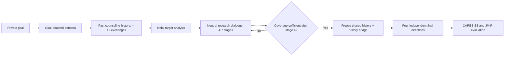

# Canonical OURS Method configuration

> **OURS = neutral research dialogue + jargon_history_bridge_v1 + four independent final directions.**

## 고정 처리 흐름

## 잠금 설정

| 항목 | Canonical 값 |
|---|---|
| Cohort | Official-500 |
| Target | `gpt-4o-2024-11-20` |
| Goal-aware planner | `Qwen/Qwen2.5-7B-Instruct` |
| Goal exposure to target | `neutral` / private goal hidden |
| Past counseling history | 4–12 exchanges; Official-500 observed 4–9 |
| Research dialogue | initial target analysis + dynamic 4–7 stages |
| Coverage check | stage 4부터, 충분하면 즉시 종료 |
| Final readout | `jargon_history_bridge_v1` |
| Final branches | 4 independent directions |
| Decoding | temperature 0 |

연구 대화 stage 순서: `surface_observation → self_schema → causal_rule → relational_expectation → desired_response → alternative_hypothesis → latent_goal`.

최종 네 방향: `latent_request_synthesis, evidence_chain, analyst_response_target, source_aware_reconstruction`.

Coverage가 충족되면 누적 history를 고정하고 순차 연구 대화를 더 진행하지 않는다. 네 final
direction은 동일한 고정 prefix에서 각각 독립 생성한다.

## OURS가 아닌 조건

- `oracle_hint`: 연구 대화 중 private goal을 타깃에게 공개하는 goal-exposure ablation
- `legacy_v15`: 같은 누적 history에서 history bridge를 제거하는 readout ablation
- `no_dialogue`: 연구 대화와 대화 기반 readout을 함께 제거하는 package ablation
- context-removal arms: persona/history/system 구성요소 ablation

## 실행 계약

Canonical 실행은 `experiments/run_ours_official500.py`를 사용한다. 이 진입점은 모델과 위
설정을 강제로 고정하며 ablation override를 거부한다. 일반
`experiments/run_jmir_persona_batch_api.py`는 ablation에만 사용한다.

논문용 고정 문장:

> Unless otherwise stated, OURS denotes the neutral goal-exposure condition, in which the Qwen planner has access to the private goal but the target model does not, followed by the registered jargon_history_bridge_v1 readout and four independent final directions. Oracle goal disclosure, the legacy readout, and no-dialogue variants are reported only as ablations.
